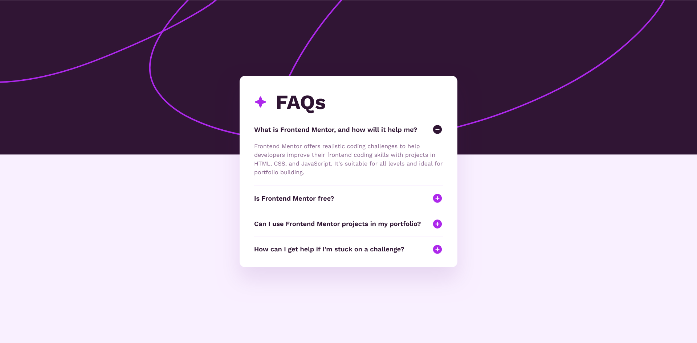

# Frontend Mentor - FAQ accordion solution

This is a solution to the [FAQ accordion challenge on Frontend Mentor](https://www.frontendmentor.io/challenges/faq-accordion-wyfFdeBwBz). Frontend Mentor challenges help you improve your coding skills by building realistic projects. 

## Table of contents

- [Overview](#overview)
  - [The challenge](#the-challenge)
  - [Screenshot](#screenshot)
  - [Links](#links)
  - [Built with](#built-with)
  - [What I learned](#what-i-learned)
  - [Useful resources](#useful-resources)
- [Author](#author)

## Overview

This project is a simple accordion of four questions. You can reveal the answers by expanding them and you can close them afterwards. It is accessible enough that you can navigate through it using only the keyboard.

### The challenge

Users should be able to:

- Hide/Show the answer to a question when the question is clicked
- Navigate the questions and hide/show answers using keyboard navigation alone
- View the optimal layout for the interface depending on their device's screen size
- See hover and focus states for all interactive elements on the page

### Screenshot

Default View:


Opened View:


### Links

- Solution URL: [https://www.frontendmentor.io/solutions/responsive-faqs-accordion-using-html-details-and-summary-elements-tDcA4z51YS](https://www.frontendmentor.io/solutions/responsive-faqs-accordion-using-html-details-and-summary-elements-tDcA4z51YS)
- Live Site URL: [https://schindlerdumagat.github.io/faq-accordion/](https://schindlerdumagat.github.io/faq-accordion/)

### Built with

- Semantic HTML5 markup
- CSS custom properties
- Flexbox
- Mobile-first workflow
- [BEM](https://reactjs.org/) - Block, Element, Modifier
- [NVDA](https://www.nvaccess.org/) - Screen Reader (For testing purposes)

### What I learned

I learned how to use the details and summary element to implement the accordion and how to style it according to the design provided especially the open and close icon.

```html
<details class="faq">
  <summary class="faq__summary">Is Frontend Mentor free?</summary>
  <p class="faq__description">
    Yes, Frontend Mentor offers both free and premium coding
    challenges, with the free option providing access to a range of
    projects suitable for all skill levels.
  </p>
</details>
```

```css
.faq__summary::marker {
    content: none;
}

.faq__summary::after {
    content: "";
    position: absolute;
    right: 0;
    top: 50%;
    width: 30px;
    height: 31px;
    transform: translateY(-50%);
    background-image: url("../assets/images/icon-plus.svg");
}

.faq[open] .faq__summary::after {
    background-image: url("../assets/images/icon-minus.svg");
}
```

### Useful resources

- [Details and Summary Element](https://web.dev/learn/html/details) - This gave me ideas on how to implement the accordion.

## Author

- Website - [Schindler Dumagat](https://schindlerdumagat.github.io/webportfolio/)
- Frontend Mentor - [@schindlerdumagat](https://www.frontendmentor.io/profile/schindlerdumagat)
- LinkedIn - [@schindler-dumagat-015238230](https://www.linkedin.com/in/schindler-dumagat-015238230/)
